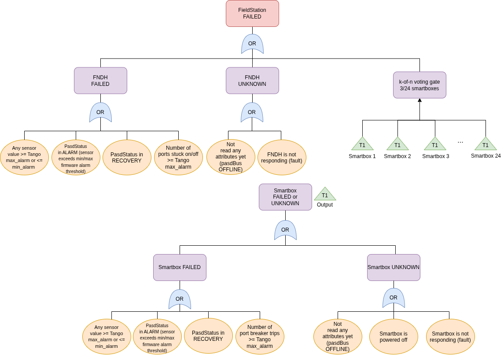
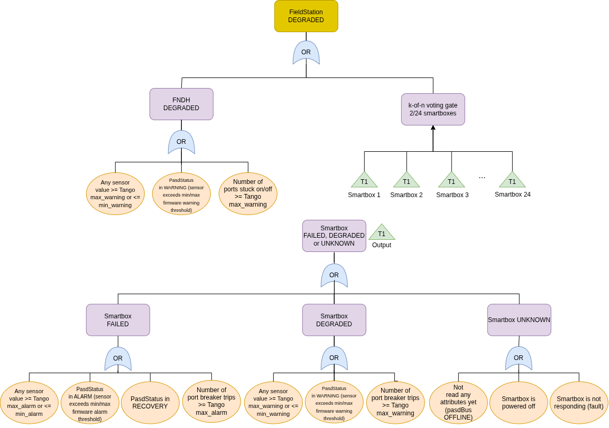

===================
Fieldstation device
===================

The Fieldstation Tango device is used to control the Power and Signal Distribution System components
for a field station, comprising a single FNDH and 24 smartboxes (see :ref:`pasd-tango-devices` for an
overview of the architecture). Most of the control and monitoring is done directly through the
relevant lower level Tango devices, but the antennas can be powered on and off through this device,
and the thermistor mounted on the floor of the FNDH EP Enclosure is also exposed as an attribute.

In addition, the Fieldstation device provides a way of setting AdminMode on all PaSD components
from a single place, and captures an overall health state of the field station.

The following attributes are provided by the Fieldstation device:

1. `OutsideTemperature` - the outside temperature in degrees Celsius, as reported by the FNDH
   (thermistor mounted on the floor of the FNDH EP Enclosure)
2. `HealthState` - the overall health state of the field station
3. `HealthReport` - A report of the health state of the field station, including the health state of
   each component (see :ref:`fieldstation-health-evaluation`)

The following commands are also provided:

+------------------------+------------------------------+-------------------------------------------------------------------+
| Command name           | Arguments                    | Description                                                       |
+========================+==============================+===================================================================+
| PowerOnAntenna         | Antenna name, e.g. "sb01-02" | Request to power on the specified antenna                         |
+------------------------+------------------------------+-------------------------------------------------------------------+
| PowerOffAntenna        | Antenna name, e.g. "sb01-02" | Request to power off the specified antenna                        |
+------------------------+------------------------------+-------------------------------------------------------------------+
| SetAntennaMasking      | JSON antenna-mask dict       | Set the masked status for one or more antennas (see below)        |
+------------------------+------------------------------+-------------------------------------------------------------------+
| Standby                | None                         | Turn on all smartboxes, but leave their ports switched off        |
+------------------------+------------------------------+-------------------------------------------------------------------+
| Off                    | None                         | Turn off power to all antennas in the fieldstation                |
+------------------------+------------------------------+-------------------------------------------------------------------+
| On                     | None                         | Turn on power to all antennas in the fieldstation                 |
+------------------------+------------------------------+-------------------------------------------------------------------+

The names of the antennas take the form of the string "sbxx-yy" where xx represents the smartbox number, and yy represents the
FEM port number on that smartbox.

Antenna masking
---------------

``SetAntennaMasking`` accepts a JSON string that maps antenna names to a boolean masked status, for
example::

    '{"sb01-01": true, "sb03-01": false}'

``true`` means the antenna is masked — its port will not be powered on. ``false`` unmasks the
antenna. Antennas absent from the dict are left unchanged, so partial updates are safe. The command
routes each antenna to its owning smartbox automatically; antennas belonging to different smartboxes
can be included in a single call.

The command returns ``REJECTED`` if none of the supplied antenna names are found on any smartbox
(e.g. all names are unrecognised, or the dict is empty). Antennas that cannot be routed to any
smartbox are logged as a warning but do not prevent the rest of the call from succeeding.

.. _fieldstation-health-evaluation:

Fieldstation health evaluation
------------------------------

The health evaluation logic for each individual device is described in the following sections:

- :ref:`pasdbus-health-evaluation`
- :ref:`fndh-health-evaluation`
- :ref:`smartbox-health-evaluation`
- :ref:`fncc-health-evaluation`

The health of the Fieldstation is determined from the health of the FNDH and Smartboxes only.
PasdBus and FNCC health are used for monitoring purposes by the engineering teams, and are
taken into account indirectly. For example, if a Modbus error is preventing communications to
the FNDH, the FNDH device's attributes will be INVALID causing its own health state to be 
``UNKNOWN`` which is treated as ``FAILED`` by Fieldstation.

The Fieldstation's health calculation is done using the following aggregation thresholds:

+----------------------+------+-------------+
| Health transition    | FNDH | Smartboxes  |
+======================+======+=============+
| FAILED -> FAILED     | 1    | 10%         |
+----------------------+------+-------------+
| FAILED -> DEGRADED   | N/A  | 5%          |
+----------------------+------+-------------+
| DEGRADED -> DEGRADED | 1    | 5%          |
+----------------------+------+-------------+

Since there is just one FNDH, its health state is directly reflected in that of the Fieldstation,
i.e. if the FNDH is ``FAILED`` the Fieldstation will be ``FAILED``, and likewise for ``DEGRADED``.
Smartboxes are taken into account based on the number which are not ``OK``. The percentages are rounded
up to the nearest integer, so for a standard deployment of 24 Smartboxes:

- If at least 3 Smartboxes are in ``FAILED`` state this will push the Fieldstation to ``FAILED``
- If at least 2 are ``FAILED`` the Fieldstation will be ``DEGRADED``
- If at least 2 are ``FAILED`` or ``DEGRADED`` the Fieldstation will be ``DEGRADED``

Note that a health state of ``UNKNOWN`` is treated as ``FAILED`` for the purpose of aggregation.

This is summarized in the following fault tree analysis diagrams for ``FAILED`` and ``DEGRADED`` health.

|

The ``HealthReport`` attribute is a JSON string which provides a summary of the subservient device states.
Possible values for each device are:

* 0 = OK
* 1 = DEGRADED
* 2 = FAILED
* 3 = UNKNOWN (also the initial state)
  
For example:

::

   '{"low-mccs/fndh/ci-1": 0, "smartboxes": {"low-mccs/smartbox/ci-1-sb01": 0,
   "low-mccs/smartbox/ci-1-sb02": 3, "low-mccs/smartbox/ci-1-sb03": 0,
   "low-mccs/smartbox/ci-1-sb04": 0, "low-mccs/smartbox/ci-1-sb05": 0,
   "low-mccs/smartbox/ci-1-sb06": 0, "low-mccs/smartbox/ci-1-sb07": 0,
   "low-mccs/smartbox/ci-1-sb08": 0, "low-mccs/smartbox/ci-1-sb09": 0,
   "low-mccs/smartbox/ci-1-sb10": 0, "low-mccs/smartbox/ci-1-sb11": 0,
   "low-mccs/smartbox/ci-1-sb12": 0}}'